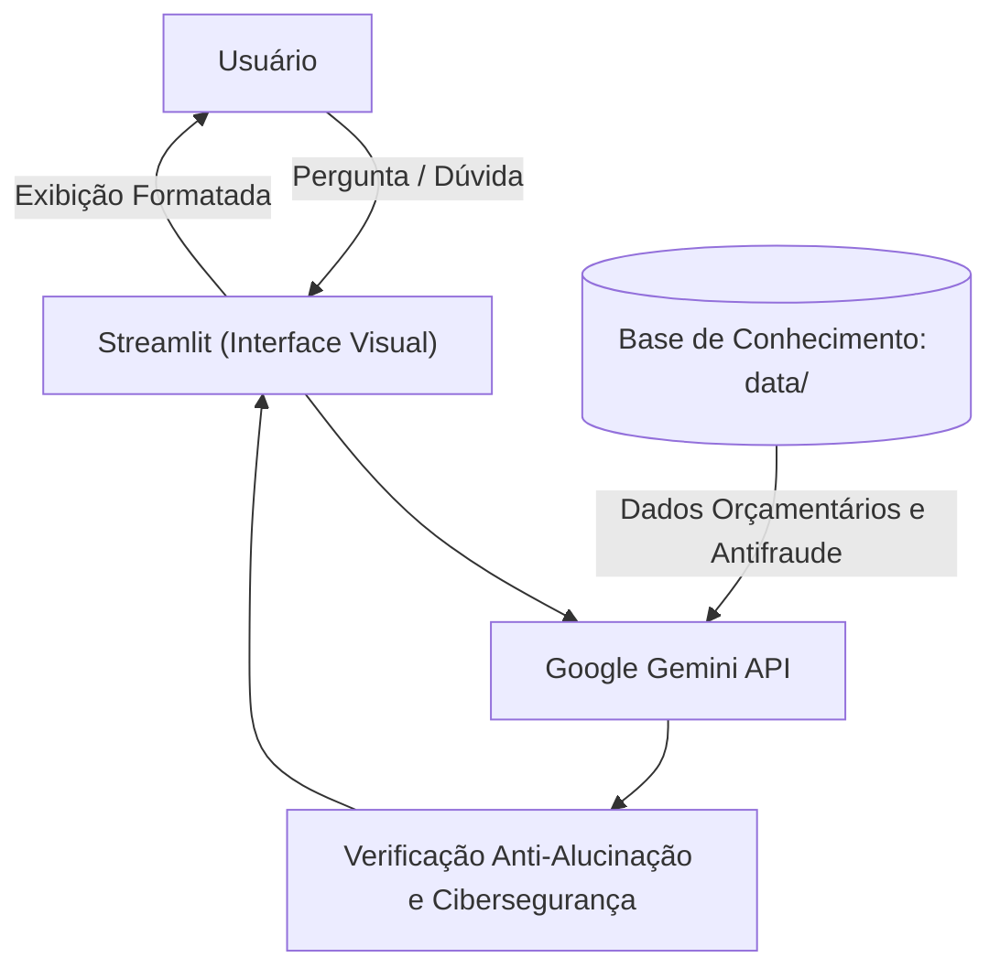

# 🛡️ GuIAFin — Guia Financeiro Inteligente

---

## 📌 Contexto e Problema

No Brasil, milhões de pessoas enfrentam o ciclo do endividamento e a sobrecarga emocional do aperto financeiro. Ao buscarem saídas rápidas, tornam-se o alvo prioritário de criminosos digitais — sendo vítimas de **falsas centrais de renegociação, boletos adulterados e cobranças ilegais de taxas de "limpeza de nome" via Pix**.

---

## 💡 A Solução: GuIAFin

O **GuIAFin** é um assistente virtual consultivo desenvolvido com Inteligência Artificial Generativa para apoiar clientes do setor bancário a retomarem o controle financeiro de forma sustentável e protegida.

### 🌟 Pilares Fundamentais:
1. **Diagnóstico Acolhedor:** Escuta ativa e mapeamento de despesas essenciais (moradia, saúde e alimentação) sem emitir julgamentos de valor sobre os gastos do usuário.
2. **Decisão Baseada em Dados (Método Avalanche):** Priorização matemática das dívidas com maiores taxas de juros (como o rotativo do cartão), sempre apresentando os **prós e contras** de cada escolha.
3. **Cibersegurança Ativa (Zero Trust & LGPD):**
   - **Zero Trust:** Nunca solicita nem armazena senhas, tokens ou números de cartão.
   - **Detecção Antifraude em Tempo Real:** Alerta proativamente sobre padrões de golpes ao identificar abordagens suspeitas de renegociação.
   - **Respostas Diretas e Objetivas:** Limitação estrita a no máximo 4 parágrafos para não sobrecarregar quem já se encontra em situação de estresse.

---

## 🏗️ Arquitetura


## 📁 Estrutura do Repositório
```
dio-lab-bia-do-futuro/
├── 📄 README.md
├── 📁 data/                            
│   ├── transacoes.csv                
│   ├── dividas_pendentes.csv          
│   ├── estrategias_renegociacao.json   
│   └── alertas_fraude_financeira.json  
├── 📁 docs/
│   ├── 01-documentacao-agente.md       
│   ├── 02-base-conhecimento.md         
│   ├── 03-prompts.md                   
│   ├── 04-metricas.md                  
│   └── 05-pitch.md                     
│── 📁 src/                             
│   ├── app.py
│   └── 📄 requirements.txt
│
├── 📁 assets/
│   └── ...
│
└── 📁 examples/
    └── README.md
```

## 🚀 Como Executar o Projeto

### Pré-requisitos
- Python 3.10 ou superior instalado;
- Uma chave de API gratuita do Google Gemini (obtida no Google AI Studio).

### Passo a passo
1. Instale as dependências
```bash
pip install -r requirements.txt
```
2. Inicie o aplicativo
```bash
streamlit run src/app.py
```
3. Interaja com o GuIAFin:
    - O navegador abrirá automaticamente.
    - Insira sua chave de API na barra lateral esquerda e comece a conversa!

## 📑 Documentação do Projeto
- 📄 [Documentação do Agente](https://github.com/Vitor-Santos-de-Andrade/dio-lab-bia-do-futuro/blob/main/docs/01-documentacao-agente.md) — Persona, Escopo e Guardrails.
- 📄 [Base de Conhecimento](https://github.com/Vitor-Santos-de-Andrade/dio-lab-bia-do-futuro/blob/main/docs/02-base-conhecimento.md) — Estratégia de Dados e Engenharia.
- 📄 [Engenharia de Prompts](https://github.com/Vitor-Santos-de-Andrade/dio-lab-bia-do-futuro/blob/main/docs/03-prompts.md) — System Prompt, Exemplos e Segurança.
- 📄 [Avaliação e Métricas](https://github.com/Vitor-Santos-de-Andrade/dio-lab-bia-do-futuro/blob/main/docs/04-metricas.md) — Cenários de Teste Reais e Resultados.
- 📄 [Roteiro do Pitch](https://github.com/Vitor-Santos-de-Andrade/dio-lab-bia-do-futuro/blob/main/docs/05-pitch.md) — Estrutura de Apresentação em 3 Minutos.
